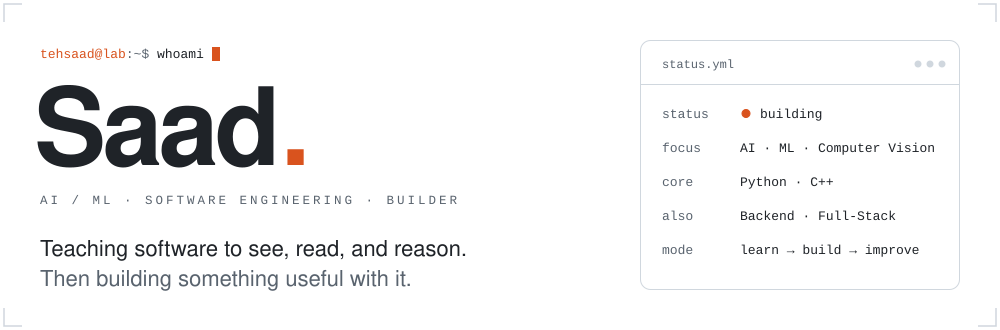
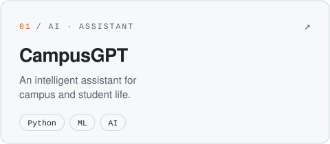
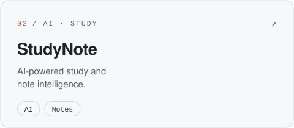
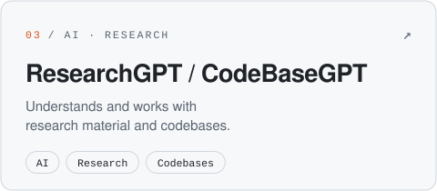
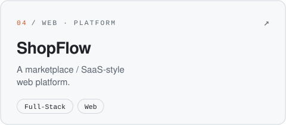
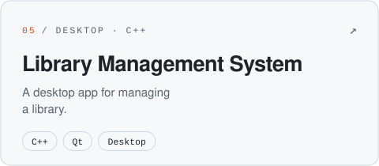
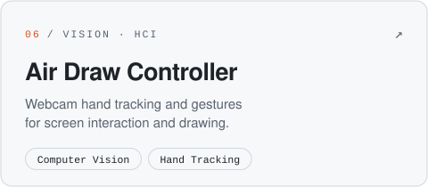
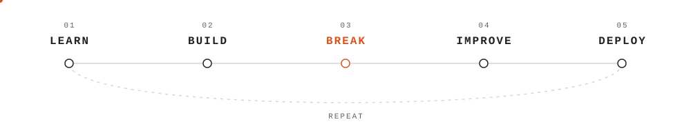

<!-- tehsaad / profile README · light + dark aware · no JavaScript -->

<p align="center">
  <a href="https://www.tehsaad.site"><picture><source media="(prefers-color-scheme: dark)" srcset="./assets/hero-dark.svg"></picture></a>
</p>

<p align="center">
  <a href="https://www.tehsaad.site"></a>
  <a href="https://www.linkedin.com/in/saad-rizwan-336b8b3ba/"></a>
  <a href="mailto:tehsaad13453310@gmail.com"></a>
  <a href="https://github.com/tehsaad"></a>
</p>

<br>

### <samp>00 / about</samp>

Software Engineering student and aspiring AI/ML engineer. I like practical software that solves real problems, and I learn fastest by building it. Lately that means moving deeper into **machine learning**, **computer vision**, and **AI-powered applications**, with Python and C++ doing most of the work.

<samp>focus →</samp> AI · Machine Learning · Computer Vision · Python · C++ · Backend · Full-Stack · AI-powered apps

<br>

### <samp>01 / builds</samp>

<p align="center">
  <a href="https://github.com/tehsaad?tab=repositories&q=CampusGPT"><picture><source media="(prefers-color-scheme: dark)" srcset="./assets/project-campusgpt-dark.svg"></picture></a>
  <a href="https://github.com/tehsaad?tab=repositories&q=StudyNote"><picture><source media="(prefers-color-scheme: dark)" srcset="./assets/project-studynote-dark.svg"></picture></a>
</p>
<p align="center">
  <a href="https://github.com/tehsaad?tab=repositories&q=ResearchGPT"><picture><source media="(prefers-color-scheme: dark)" srcset="./assets/project-researchgpt-dark.svg"></picture></a>
  <a href="https://shopflow-web-ten.vercel.app"><picture><source media="(prefers-color-scheme: dark)" srcset="./assets/project-shopflow-dark.svg"></picture></a>
</p>
<p align="center">
  <a href="https://github.com/tehsaad?tab=repositories&q=Library"><picture><source media="(prefers-color-scheme: dark)" srcset="./assets/project-library-dark.svg"></picture></a>
  <a href="https://github.com/tehsaad?tab=repositories&q=Air"><picture><source media="(prefers-color-scheme: dark)" srcset="./assets/project-airdraw-dark.svg"></picture></a>
</p>

<p align="center"><samp>more on <a href="https://www.tehsaad.site/projects.html">tehsaad.site/projects</a> · <a href="https://www.tehsaad.site/AI-Specialization.html">AI lab &amp; roadmap</a> · <a href="https://www.tehsaad.site/journey.html">journey</a></samp></p>

<br>

### <samp>02 / stack</samp>

<p align="center">
  <picture>
    <source media="(prefers-color-scheme: dark)" srcset="https://skillicons.dev/icons?i=py,cpp,js,ts,opencv,sklearn,django,fastapi,html,css,tailwind,postgres,sqlite,git,github,githubactions,linux,vscode&perline=9&theme=dark">
    
  </picture>
</p>

```yaml
languages:  [Python, C++, JavaScript, TypeScript]
ai_data:    [Machine Learning, Computer Vision, NumPy, Pandas]
backend:    [Django, FastAPI]
frontend:   [HTML, CSS, TypeScript, Tailwind CSS]
databases:  [PostgreSQL, SQLite]
tooling:    [Git, GitHub, GitHub Actions, Linux, VS Code]
```

<br>

### <samp>03 / method</samp>

<p align="center">
  <picture><source media="(prefers-color-scheme: dark)" srcset="./assets/loop-dark.svg"></picture>
</p>

Projects start local. They get broken on purpose, rebuilt better, and pushed to the web once they earn it.

<br>

### <samp>04 / interests</samp>

<samp>AI Engineering</samp> · <samp>Machine Learning</samp> · <samp>Computer Vision</samp> · <samp>Backend Engineering</samp> · <samp>Full-Stack Development</samp> · <samp>Software Architecture</samp> · <samp>Developer Tools</samp> · <samp>Automation</samp> · <samp>AI-powered Apps</samp>

<br>

### <samp>05 / activity</samp>

<p align="center">
  <picture>
    <source media="(prefers-color-scheme: dark)" srcset="https://raw.githubusercontent.com/tehsaad/tehsaad/output/contributions-dark.svg">
    
  </picture>
</p>

<br>

<p align="center"><samp>// currently building · <a href="https://github.com/tehsaad?tab=repositories">all repositories ↗</a> · <a href="https://www.tehsaad.site/contact.html">get in touch ↗</a></samp></p>
